# Obciazenie psychiczne swiata 

Wizualizacja danych o zdrowiu psychicznym (Power Bi)


## 🎯Cel raportu: 

Przedstawienie globalnych różnic w zakresie zdrowia psychicznego, ze szczególnym uwzględnieniem występowania depresji i samobójstw. W analizie wykorzystano dane demograficzne, ekonomiczne oraz wskaźniki szczęścia, by lepiej zrozumieć czynniki towarzyszące kryzysom psychicznym.

## Dane:

- ***Zakres danych***: 2015–2022
- ***Źródła danych***: Kaggle {([World Happiness 2015-2024](https://www.kaggle.com/datasets/yadiraespinoza/world-happiness-2015-2024/data?select=world_happiness_2015.csv)), ([World Population Dataset](https://www.kaggle.com/datasets/iamsouravbanerjee/world-population-dataset?select=world_population.csv))} , WHO [*](https://www.who.int/data/gho/data/indicators/indicator-details/GHO/estimated-population-based-prevalence-of-depression), Our World in Data [*](https://data-explorer.oecd.org/vis?lc=en&ac=false&tm=DF_COM&pg=0&snb=1&vw=tb&df[ds]=dsDisseminateFinalDMZ&df[id]=DSD_HEALTH_STAT%40DF_COM&df[ag]=OECD.ELS.HD&pd=2015%2C&dq=.A......_T.STANDARD....&to[TIME_PERIOD]=false)
- ***Narzędzie***: Power Bi


## Metodologia & najważniejsze etapy:
1. Ładowanie danych
2. Czyszczenie danych (usuwanie pustych wierszy, ujednolicanie formatu danych)
3. Przygotowanie tabel pomocniczych
4. Utworzenie miar i parametrów
5. Ustalanie modelu danych 
6. Projektowanie interaktywnych dashboardów zawierających m.in.:
      - dynamiczne filtry,
      - parametry,
      - zakładki,
      - animowaną oś odtwarzania (trend czasowy),
      - podpowiedzi kontekstowe (tooltips).


##  Modelowanie danych
### ✏️ Struktura modelu danych
Model danych składa się z tabel faktów (Depresja, Samobójstwa, Szczęście) oraz tabel wymiarów (Geografia, Kalendarz), powiązanych relacjami wiele-do-jednego. Odpowiedni typ relacji ma za zadanie utrzymanie:
 - prawidłowego filtrowania danych przy pomocy slicerów,
 - odpowiedniej agregacji wskaźników w zależności od wybranego kraju lub roku,
 - spójności między wizualizacjami.

 Screenshot modelu danych:
   <p align="center">
  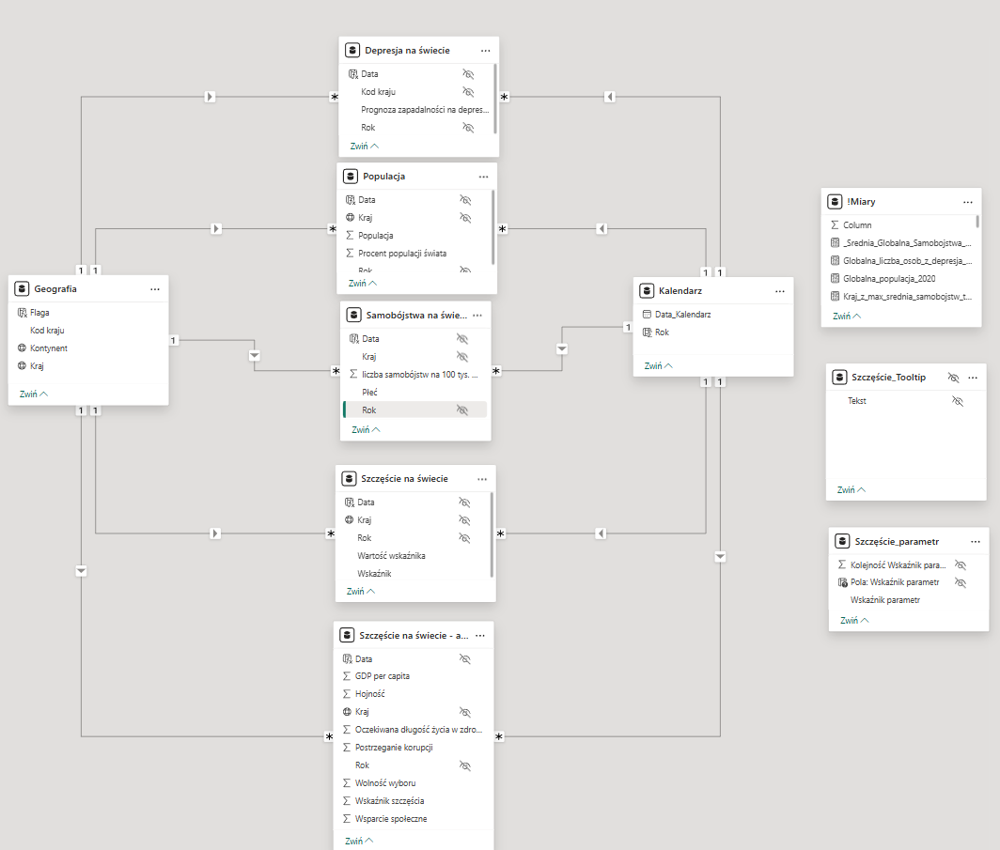
</p>


### ✅ Tabele pomocnicze - Tabela kalendarza
Utworzenie dedykowanej tabeli kalendarza przy użyciu języka DAX, miało na celu umożliwienie bardziej zaawansowanej analizy opartej na czasie, np. filtrowanie danych według lat, użycie parametrów czy animowanej osi odtwarzania (Play Axis).
Kod DAX:

```dax
Kalendarz = CALENDAR(DATE(1970,1,1), DATE(2024,12,31))
Rok = YEAR('Kalendarz'[Data_Kalendarz])

```
   Tabela zawiera pełny zakres dat dziennych oraz dodatkową kolumnę z wyodrębnionym rokiem.Pozwala to na lepszą agregację danych, filtrowanie oraz korzystanie z selektorów (slicerów) w wizualizacjach opartych na czasie.


   Screenshot tabeli:
   <p align="center">
  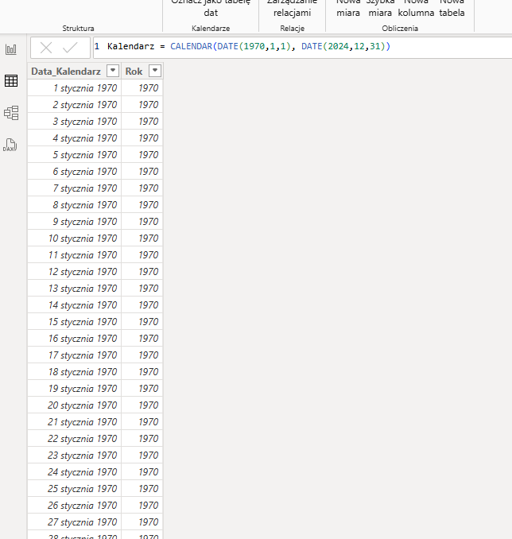
</p>

### 🔢 Miary

Przykładowa miara wykorzystana w karcie dotyczącej globalnej liczby osób z depresją w 2020 roku:
```dax
Globalna_liczba_osob_z_depresja_2020 = 
CALCULATE(
    SUMX(
        VALUES('Depresja na świecie'[Kod kraju]),
        VAR KodKraju = 'Depresja na świecie'[Kod kraju]
        VAR WskaznikDepresji =
            CALCULATE(
                AVERAGE('Depresja na świecie'[Prognoza zapadalności na depresję %]),
                'Depresja na świecie'[Kod kraju] = KodKraju
            )
        VAR Kraj =
            LOOKUPVALUE(
                Geografia[Kraj],
                Geografia[Kod kraju], KodKraju
            )
        VAR Populacja2020 =
            LOOKUPVALUE(
                Populacja[Populacja],
                Populacja[Kraj], Kraj,
                Populacja[Rok], 2020
            )
        RETURN
            DIVIDE(WskaznikDepresji * Populacja2020, 100, 0)
    ),
    REMOVEFILTERS('Geografia') 
```
Oblicza ona szacunkową globalną liczbę osób cierpiących na depresję w roku 2020. Dla każdego kraju miara łączy wskaźnik zapadalności na depresję (w %) ze skorelowaną populacją danego kraju w roku 2020, a następnie sumuje te wartości dla całego świata. Miara wykorzystuje m.in. funkcje CALCULATE, SUMX, LOOKUPVALUE i DIVIDE, a także usuwa filtry geograficzne, by zapewnić globalny wymiar analizy.

Zastosowanie miary:
<p align="center">
  
</p>


### 🎛 Parametry
W projekcie utworzono również parametr umożliwiający porównanie poziomu szczęścia z innymi zmiennymi (hojność, wsparcie społeczne, postrzeganie korupcji, wolności wyboru). 

```DAX
Szczęście_parametr = {
    ("Wskaźnik wsparcia społecznego", NAMEOF('!Miary'[Wskaźnik_wsparcia społecznego]), 0),
    ("Wskaźnik wolności wyboru", NAMEOF('!Miary'[Wskaźnik_wolności wyboru]), 1),
    ("Wskaźnik hojności", NAMEOF('!Miary'[Wskaźnik_hojności]), 2),
    ("Wskaźnik postrzegania korupcji", NAMEOF('!Miary'[Wskaźnik_postrzegania_korupcji]), 5)
}
```
Slicer powiązany z parametrem oddziałuje na wykres liniowy, co umożliwia porównanie wybranego przez użytkownika parametru względem wskaźnika szczęścia w czasie. 
Zastosowanie parametru:
<p align="center">
  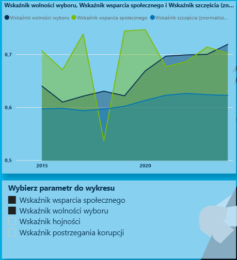
</p>

## 📈 Wizualizacja i interaktywność
Wykorzystane wizualizacje:
- macierze top krajów z flagami,
- mapy,
- miernik,
- karty,
- formatowanie warunkowe macierzy,
- wykresy liniowe, punktowe, słupkowe.

Interaktywność:
- strzałki nawigacyjne,
- nawigator stron,
- zakładki (bookmarks)
- tooltip,
- slicery,
- animowana oś czasu,

Zakładki (bookmarks), umożliwiają prezentację różnych widoków raportu w jednej sekcji:
   - Zakładka 1: Mapa powiązana ze slicerem, pozwalająca filtrować dane geograficznie (według kontynentu i kraju).
   - Zakładka 2: Tabela Top 10 krajów z najwyższym udziałem w światowej depresji i flagą kraju – aktualizująca się zgodnie z        filtrami slicera (według kontynentu i kraju).
   - Zakładka 3: Miernik KPI prezentujący % populacji świata chorych na depresję w 2020 roku.

W celu ułatwienia poruszania się między widokami raportu, zastosowano nawigator stron (Page Navigator), który umożliwia intuicyjne przełączanie się między dashboardami. Wykorzystano także oś odtwarzania (trend czasowy), dzięki której możliwe jest automatyczne przeglądanie zmian danych w kolejnych latach. Funkcja ta wspiera analizę trendów i obserwację długofalowych zjawisk. Kolejnym ciekawym interaktywnym elementem projektu są podpowiedzi kontekstowe (tooltips) wyświetlane po najechaniu kursorem na wykres, co ułatwia analizę szczegółowych danych.

##  Podgląd dashboardów

<p align="center">
  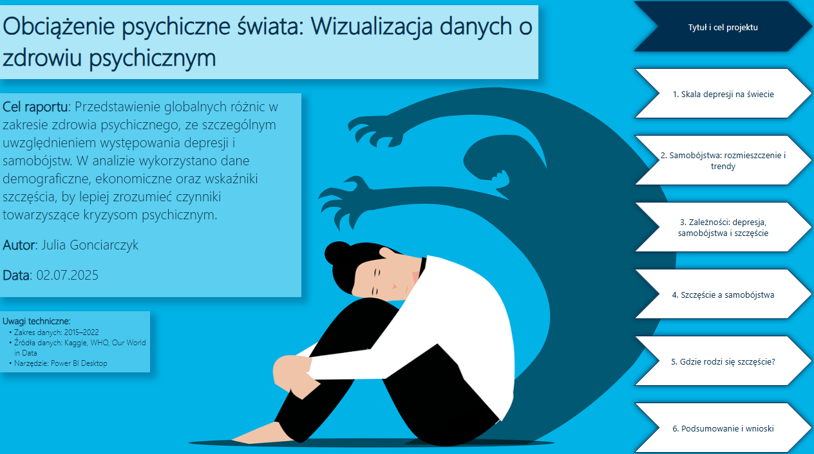<br>
  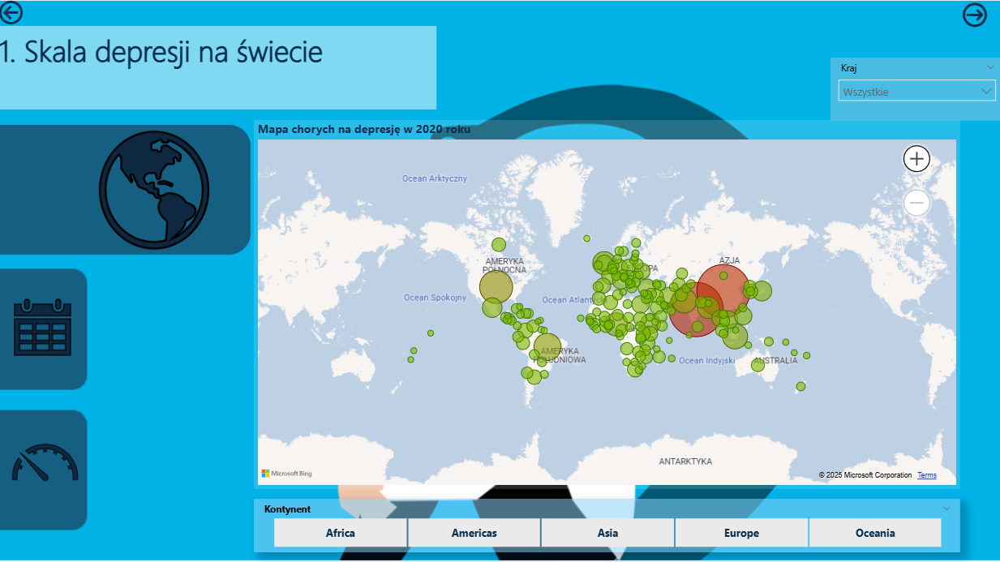   
  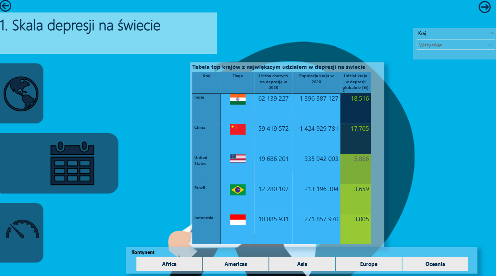
  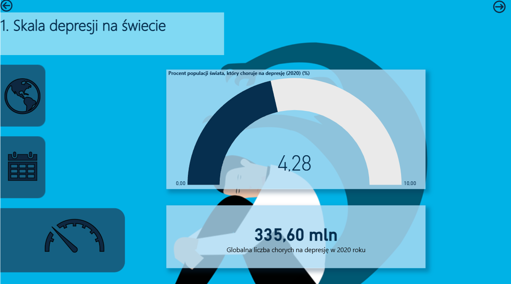    
  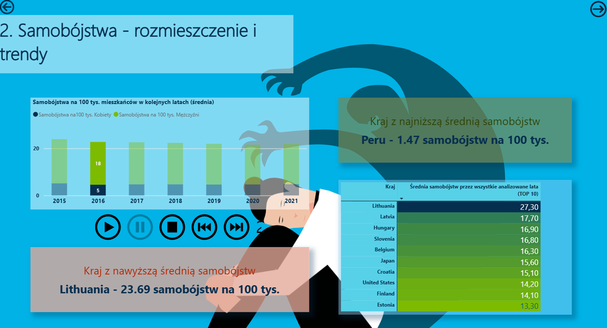<br>
  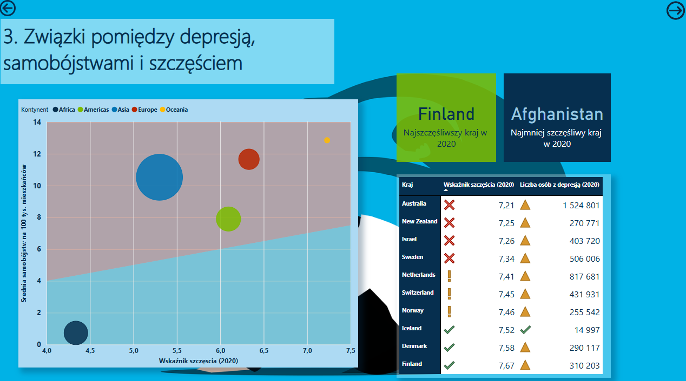
  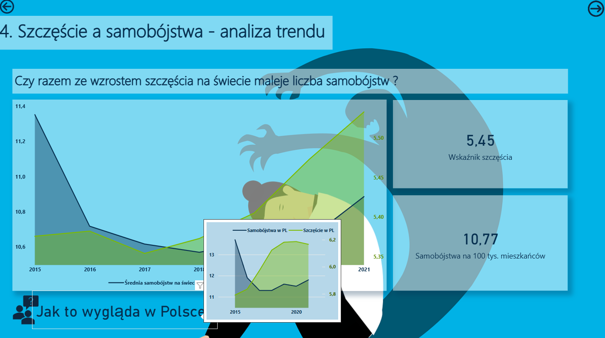
  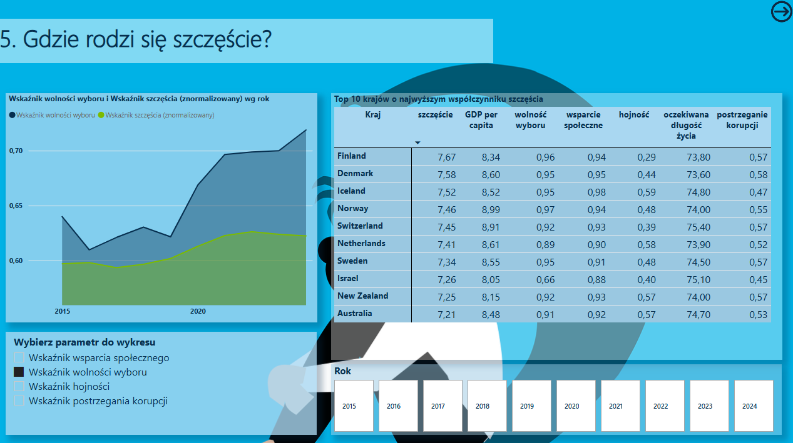
  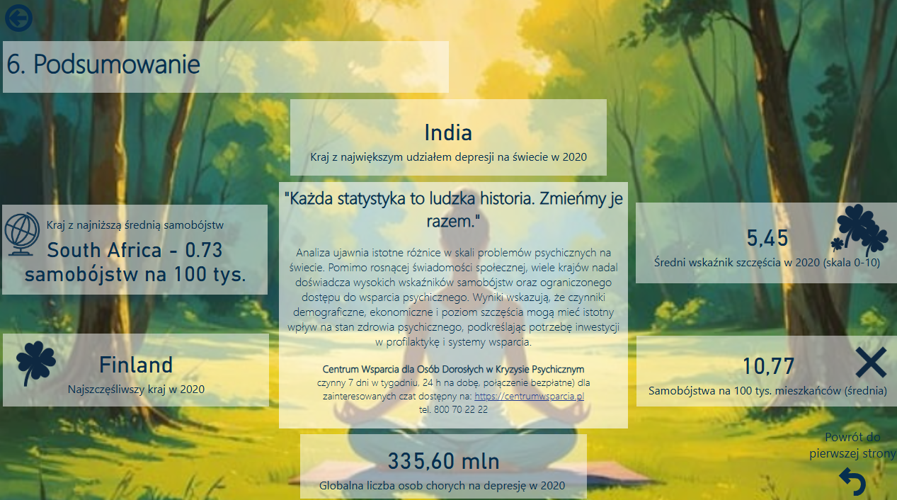
</p>


Dashboardy przekazują następujące informacje:
- trendy zapadalności na depresję i samobójstw na świecie w czasie,
- Top 10 krajów z największą liczbą osób chorych na depresję oraz największym współczynnikiem szczęścia, 
- wskaźnik średniej liczby samobójstw na 100 tys. mieszkańców,
- procent populacji świata chorych na depresję w roku 2020,
- trend średniej liczby samobójstw na 100 tys. mieszkańców w zależności od płci,
- kraje z najwyższą i najniższą średnią samobójstw na 100 tys. mieszkańców,
- zależność pomiędzy wskaźnikiem szczęścia i średnią samobójstw na różnych kontynentach,
- najszczęśliwszy i najmniej szczęśliwy kraj w 2020,
- korelację pomiędzy szczęściem ludzi na świecie a liczbą samobójstw w czasie,
- dynamiczne porównanie wskaźnika szczęścia względem wybranego przez użytkownika wzkaźnika,
- korelacje pomiędzy zamożnością mieszkańców, hojnością, postrzeganiem korupcji, spodziewaną długością szczęśliwego życia i wskaźnikiem szczęscia w czasie.

## 📂 Plik .pbix / dostęp do raportu

- `Obciążenie psychiczne - Julia Gonciarczyk.pbix` - główny plik projektu Power BI


## Film
🎥 *Demo video coming soon - showing full interactivity of the report*

## Podsumowanie
Wnioski:


## Wyzwania w projekcie
- Dane dotyczące takich krajów jak np. Rosja, szczególnie w kontekście depresji i samobójstw były niepełne, co umożliwiało uwzględnienie tego kraju w porównaniach. 
- Dane dotyczące depresji dotyczyły konkretnego roku, natomiast informacje na temat samobójstw i szczęścia umożliwiały obserwację trendów w czasie.


**ENGLISH VERSION BELOW**
# 🧠 Mental Burden of the World

Interactive data report on global mental health (Power BI)

## 🎯 Project Goal

To present global disparities in mental health, with particular focus on the prevalence of **depression** and **suicide**. The analysis combines **demographic**, **economic**, and **happiness-related** data to better understand the factors contributing to mental health crises worldwide.

## 📊 Data

- **Time range**: 2015–2022  
- **Sources**:  
  - Kaggle:  
    - [World Happiness 2015–2024](https://www.kaggle.com/datasets/yadiraespinoza/world-happiness-2015-2024)  
    - [World Population Dataset](https://www.kaggle.com/datasets/iamsouravbanerjee/world-population-dataset)  
  - WHO: [Prevalence of Depression](https://www.who.int/data/gho/data/indicators/indicator-details/GHO/estimated-population-based-prevalence-of-depression)  
  - Our World in Data: [Suicide & Health Data](https://data-explorer.oecd.org/vis?lc=en&ac=false&tm=DF_COM)  
- **Tool**: Power BI

## ⚙️ Methodology

1. Data import and cleaning (removing nulls, formatting)
2. Creating helper tables (Calendar, Geography)
3. Defining DAX measures and parameters
4. Modeling relationships (many-to-one)
5. Designing interactive dashboards with:
   - dynamic filters and slicers
   - bookmarks and page navigation
   - animated time axis (Play Axis)
   - contextual tooltips

## 🧩 Data Model

- **Fact Tables**: Depression, Suicide, Happiness  
- **Dimension Tables**: Geography, Calendar  
- **Relationships**: Many-to-one for accurate filtering and aggregation


### 📅 Calendar Table (DAX)

```dax
Kalendarz = CALENDAR(DATE(1970,1,1), DATE(2024,12,31))
Rok = YEAR('Kalendarz'[Data_Kalendarz])
```
Enables year-based filtering, animations, and time trends. Supports time slicers and proper aggregation

### 🔢 Measures
Example of measure used in card about global depression in 2020. 
Code of measure:

```dax
Globalna_liczba_osob_z_depresja_2020 = 
CALCULATE(
    SUMX(
        VALUES('Depresja na świecie'[Kod kraju]),
        VAR KodKraju = 'Depresja na świecie'[Kod kraju]
        VAR WskaznikDepresji =
            CALCULATE(
                AVERAGE('Depresja na świecie'[Prognoza zapadalności na depresję %]),
                'Depresja na świecie'[Kod kraju] = KodKraju
            )
        VAR Kraj =
            LOOKUPVALUE(
                Geografia[Kraj],
                Geografia[Kod kraju], KodKraju
            )
        VAR Populacja2020 =
            LOOKUPVALUE(
                Populacja[Populacja],
                Populacja[Kraj], Kraj,
                Populacja[Rok], 2020
            )
        RETURN
            DIVIDE(WskaznikDepresji * Populacja2020, 100, 0)
    ),
    REMOVEFILTERS('Geografia') 
```
This measure estimates the global number of people with depression in 2020 by combining prevalence rates with population data.
<p align="center">
  
</p>

### 🎛️ Parameter
Happiness parameter is used to compare happiness index with user-selected indicators. 
```dax
Szczęście_parametr = {
    ("Social Support Index", NAMEOF('!Miary'[Wskaźnik_wsparcia społecznego]), 0),
    ("Freedom of Choice Index", NAMEOF('!Miary'[Wskaźnik_wolności wyboru]), 1),
    ("Generosity Index", NAMEOF('!Miary'[Wskaźnik_hojności]), 2),
    ("Perceived Corruption Index", NAMEOF('!Miary'[Wskaźnik_postrzegania_korupcji]), 5)
}
```
Parameter application:
<p align="center">
  
</p>


## 📈 Visuals & Interactivity
Visual types:
- Maps and matrix views with flags
- KPI cards and gauges
- Line, bar, and scatter charts
- Conditional formatting

Interactivity:
- Dynamic slicers and filters
- Bookmarks for view switching
- Page navigator
- Play axis (animated time trends)
- Tooltips on hover

Example of Bookmarks:
Bookmark 1: Geo map filtered by continent/country
Bookmark 2: Top 10 countries by depression prevalence
Bookmark 3: KPI showing % of world population with depression (2020)

## 🖥️ Dashboard Previews
<p align="center">          </p>

## 🔍 Insights
The report reveals:
- Trends in global depression and suicide rates over time
- Top 10 countries by depression count and happiness score
- Suicide rate per 100k citizens (by gender & country)
- Correlations between happiness, wealth, generosity, corruption, and social support
- Dynamic comparison of happiness index vs. selected variables
- Identification of the happiest and least happy countries in 2020
- Temporal correlation between happiness and suicide rates globally

## 📁 Power BI File
- `Obciążenie psychiczne - Julia Gonciarczyk.pbix`

## 🎥 Demo Video
Coming soon – showing full interactivity of the report

## ⚠️ Challenges
- Some countries (e.g., Russia) had incomplete data on depression and suicide, which limited their inclusion in comparative analysis.  
- Depression data was limited to a specific year, while suicide and happiness data allowed for observing trends over time.
